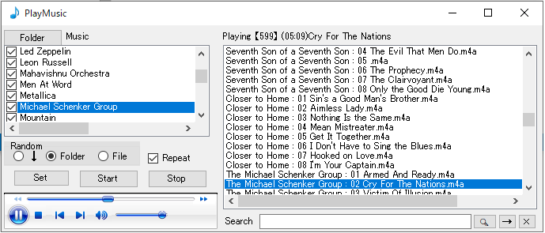

# MediaPlayer is a C # project created in Visual Studio 2017(2010) and is software that plays music files(m4a,wav) in folders.

## Releases-> TAG01-> Assets-> PlayMusicFolder.zip has all of the projects.
## In this project, you can understand some C # techniques.
#### Basic operation of music files in WindowsMediaPlayer
#### How to handle files and folders using List<>
#
#
# MediaPlayerは、Visual Studio 2017(2010) で作成されたC#のプロジェクトで、フォルダーの中の音楽ファイル(m4a,wav)を再生するソフトです。

## Releases -> TAG01 ->Assets -> PlayMusicFolder.zip にプロジェクトの全てがあります。
#### このプロジェクトでは、いくつかのC#テクニックを理解できます。
#### WindowsMediaPlayer での音楽ファイルの基本的な操作方法
#### List<> を使用してのファイルとフォルダーの取扱方法